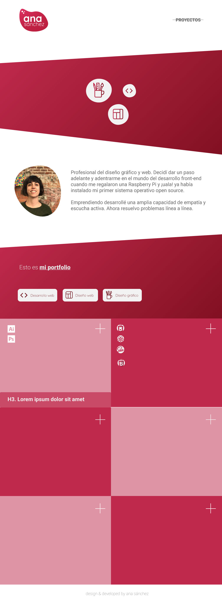

# Portfolio

This project is developed with HTML5, Gulp, Sass and JavaScript.

###### Structure

```
/
`- _src
   |- assets
   |  |- images
   |  |- js
   |  `- scss
   |     `- core
   |     `- components
   |     `- pages
   |     `- main.scss
   |     `- normalize.scss
   |
   `- templates
      `- partials
      `- index.html
      `- projects.html

```

      
## Starting 🚀

With the following instructions you can clone the repository on your local computer and develop it.

```npm install```

Next you can run


```gulp```

And then

```gulp docs```

 Upload them to the repo and enable the master/docs/ option in GitHub Pages.

## FASE 2: diseño y desarrollo  

